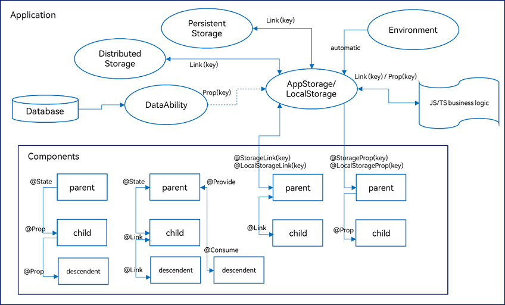

# OpenHarmony 探索

## 一、鸿蒙发展史：

### 1、容易混淆的概念

​		这4年来确实陆陆续续鸿蒙听到很多概念，关于鸿蒙开源鸿蒙(OpenHarmony)和鸿蒙OS(HarmonyOS)有啥区别。实际上除了OpenHarmony和HarmonyOS不一样之外，就连鸿蒙操作系统都跟OpenHarmony不同

### 2、鸿蒙初始

​	鸿蒙操作系统其实是华为为了实现设备之间的互联化和智能化，内部自研的一个系统，有着自己的技术愿景

- 不同设备，同一系统
- 硬件互助，形成超级终端
- 一次开发，多端部署

当初这个系统的发布其实只在最简单的智慧屏幕设备开始试水；

### 3、OpenHarmony

​	后来老美迎来了制裁，为了让更多开发者能够参与进来，华为在2020年和2021年分2次，将鸿蒙操作系统的基础能力捐给了开放原子开源基金会，然后在开放原子开源基金会的孵化下将鸿蒙操作系统加其他共建伙伴贡献结合起来，就形成了我们常说的[OpenHarmony](https://gitee.com/openharmony/docs/tree/master/zh-cn)

#### 3.1、什么是OpenHarmony应用？

基于OpenHarmony开发编译构建工具链生成，并能在搭载OpenHarmony系统的设备上运行的应用。

- 声明响应式编程，开发效率更高；
- 兼容JS语法，开发更易上手；
- 一套代码，多端运行，开发成本更低；

### 4、HarmonyOS

​	能在手机上跑的[HarmonyOS](https://developer.harmonyos.com/cn/develop/deveco-studio/#download)是啥? 那是由于一开始OpenHarmony生态太过弱小，很多应用都没有人开发，华为又被美国制裁，为了最大程度保障用户体验，**华为选择兼容Android**，猥琐发育，比如无法使用GMS，华为开发了自己的HMS，在OpenHarmony基础上把上述这些都加进去形成华为商用版的HarmonyOS;

​	**HarmonyOS1.0到4.0都是兼容Android的**，所以被认为是了套壳Android；

​		目前HarmonyOS已经发布到4.0版本，并且有了一个重大的更新就是，在华为将方舟编译器1更新到3.1版本之后在最新的api9上，打通了和OpenHarmony的API，都可以使用ArKTs来开发，这样开发者打出的同一个HAP包就可以在这2个平台上运行，之前是不可以的。现在是一次程序编译器就可以帮你自动适配好 例如折叠屏手机适配等

### 5、HarmonyOS NEXT

​	**HarmonyOS Nex核心点是不再兼容谷歌的AOSP，是一个独立的操作系统，也就是说，你的  Android APK 已经不能在 HarmonyOS NEXT 上运行，因为系统已经不存在 AOSP 代码，甚至没有 JVM 。**

​	HarmonyOS NEXT是在2023年8月4日发布的，而面向所有开发者开放的时间预计将在2024年第一季度。更新后的鸿蒙，**会使用全自研内核，去掉了传统的 AOSP 代码，仅支持鸿蒙内核和鸿蒙系统的应用减少了 40% 的冗余代码，使系统的流畅度、能效、纯净安全特性大为提升**。

​	把OpenHarmony比作刚刚研发的电机，HarmonyOS就是在妥协下产生的油电混动的插混汽车；

​	而HarmonyOS NEXT就是去掉了AOSP后的纯电车；

### 6、Harmony系统设计理念

鸿蒙系统设计层面具备以下3个特征：

#### 6.1、一次开发，多端部署

​	“一次开发，多端部署”指的是**一个工程，一次开发上架，多端按需部署**，目的是为了 支撑开发者高效地开发多种终端设备上的应用

> 这里的端是 搭载鸿蒙系统的多种硬件

> 为了提高开发这么多种端的开发效率，提供了DevEco Studio IDE一站式开发平台，而且也是JetBrain系列的，非常熟悉；UI上也是定义了一套标准极大提高多端开发的效率

#### 6.2、可分可合，自由流转

- **可分可合**

  指的是开发阶段，开发者通过业务解耦，把不同的业务拆分为多个模块。在部署态，开发者可以将一个或多个模块自由组合，打包成一个 App Pack 统一上架。在分发运行态，每个 HAP都可以单独分发满足用户单一使用场景，也可以多个 HAP 组合分发满足用户更加复杂的使用场景；

  

  模式一：打包成多个App Pack，不同App Pack的包名是不一样的，每个App Pack都需要单独上架。在运行态，应用和服务的生命周期完全独立。

  模式二：打包成一个 App Pack，App Pack 里面的 HAP 包名相同，统一上架。在运行态，应用生命周期完全共享。

- 自由流转

  鸿蒙系统提供了设备间自由流转的能力，使得开发者可以方便地开发出跨越多个设备的应用，自由流转可分为跨端迁移和多端协同两种情况。他们分别是时间上的串行交互和时间上 的并行交互。自由流转不仅带给用户全新的交互体验，也为开发者搭建了一座从单设备时代 通往多设备时代的桥梁。 使用过华为手机+平板的人应该深深体会过超级终端带来的便利；

  如：手机与电脑、平板、搭载鸿蒙系统的汽车

- 手机与电脑、平板、搭载鸿蒙系统的汽车

  

#### 6.3、统一生态，原生智能

- 统一生态

  移动操作系统和桌面操作系统的跨平台应用开发框架不尽相同，从渲染方式的角度可以归纳为 WebView 渲染、原生渲染和自渲染这三类，鸿蒙系统对应的提供系统 WebView、ArkUI 框架和 XComponent 能力来支撑三种类型的跨平台框架的接入主流跨平台开发框架已有版本正在适配 HarmonyOS，基于这些框架开发的应用可以以较低成本迁移到鸿蒙系统

- 原生智能

  鸿蒙系统内置强大的 AI 能力，面向鸿蒙生态应用的开发，通过不同层次的 AI 能力开放，满足开发者的不同开发场景下的诉求，降低应用的开发门槛，帮助开发者快速实现应用智能化

## 二、OpenHarmony  开发

### 1、开发环境搭建

鸿蒙开发套件也算比较丰富包含设计、开发、测试、运维套件以及 OS 开放能力集；

[Studio、SDK、Tool 下载地址](https://gitee.com/openharmony/docs/blob/master/zh-cn/release-notes/OpenHarmony-v4.0-release.md#https://gitee.com/link?target=https%3A%2F%2Fcontentcenter-vali-drcn.dbankcdn.cn%2Fpvt_2%2FDeveloperAlliance_package_901_9%2F9a%2Fv3%2FHBD3TfhiT_GFqeX44Qcwtg%2Fdevecostudio-windows-4.0.0.600.zip%3FHW-CC-KV%3DV1%26HW-CC-Date%3D20231027T004333Z%26HW-CC-Expire%3D315360000%26HW-CC-Sign%3D279824A013505EFC063997614DC1B6AB1C3A2EE5AC48CEF15DDB3E1F79DA435A)：搜“配套关系”

#### 1.1、ohpm

- [官方中央仓库](https://ohpm.openharmony.cn/#/cn/home)(openharmony package manager)；
- 鸿蒙生态三方库的包管理工具，类似前端的npm和yarn，支持共享包的发布、安装和依赖管理；
- API 9 开始从 npm 切换至了 ohpm，支持历史版本 npm 迁移过来；
- 使用体验上与 npm 大体一样，只是有了华为自己独立的官方中央仓库，切割了部分 npm 能力；
- 开发体系最终就是 **TypeScript + npm**，完全的前端开发体验；

### 2、项目介绍

#### 2.1、项目结构-Stage模型

- **AppScope > app.json5**：应用的全局配置信息。 
- **entry**：HarmonyOS工程模块，编译构建生成一个HAP包。 
  - **src > main > ets**：用于存放ArkTS源码。 
  - **src > main > ets > entryability**：应用/服务的入口。 
  - **src > main > ets > pages**：应用/服务包含的页面。 
  - **src > main > resources**：用于存放应用/服务所用到的资源文件，如图形、多媒体、字符串、布局文件等。关于资源文件，详见[资源分类与访问](https://developer.harmonyos.com/cn/docs/documentation/doc-guides-V3/resource-categories-and-access-0000001711674888-V3)。 
  - **src > main > module.json5**：Stage模型模块配置文件。主要包含HAP包的配置信息、应用/服务在具体设备上的配置信息以及应用/服务的全局配置信息。具体的配置文件说明，详见[module.json5配置文件](https://developer.harmonyos.com/cn/docs/documentation/doc-guides-V3/module-configuration-file-0000001427744540-V3)。 
  - **build-profile.json5**：当前的模块信息、编译信息配置项，包括buildOption、targets配置等。其中targets中可配置当前运行环境，默认为HarmonyOS。 
  - **hvigorfile.ts**：模块级编译构建任务脚本，开发者可以自定义相关任务和代码实现。 
- **oh_modules**：用于存放三方库依赖信息。关于原npm工程适配ohpm操作，请参考[历史工程迁移](https://developer.harmonyos.com/cn/docs/documentation/doc-guides-V3/project_overview-0000001053822398-V3#section167081936119)。 
- **build-profile.json5**：应用级配置信息，包括签名、产品配置等。
- **hvigorfile.ts**：应用级编译构建任务脚本。

#### 2.2、FA模型与Stage模型

- HarmonyOS先后提供了[两种应用模型](https://developer.harmonyos.com/cn/docs/documentation/doc-guides-V3/application-model-description-0000001493584092-V3)：

  - FA（Feature Ability）模型：HarmonyOS早期版本开始支持的模型，已经不再主推。

  - **Stage模型（主推）**：HarmonyOS 3.1 Developer Preview版本开始新增的模型，是目前主推且会长期演进的模型。在该模型中，由于提供了AbilityStage、WindowStage等类作为应用组件和Window窗口的“舞台”，因此称这种应用模型为Stage模型。

- **Stage模型与FA模型最大的区别**：

​		Stage模型中，多个应用组件**共享同一个ArkTS引擎**实例；而FA模型中，每个应用组件独享一个ArkTS引擎实例。因此在Stage模型中，应用组件之间可以方便的**共享对象和状态**，同时**减少应用运行对内存的占用**。Stage模型作为主推的应用模型，开发者通过它能够更加便利地开发出分布式场景下的复杂应用。

### 3、ArkCompiler(方舟编译器)

[方舟编译器](https://gitee.com/openharmony/arkcompiler_ets_runtime/blob/master/docs/overview-zh.md)是鸿蒙系统作为手机、平板、电视、车机和智能穿戴等多种设备统一操作系统的编译运行时底座。 支持多种编程语言、多种芯片平台联合编译、运行而设计的统一编译运行时平台。支持包括动态类型和静态类型语言在内的多种编程语言，如 ArkTS、TS、JS 。

主要分成两个部分，**编译工具链**ArkCompiler Toolchain）与**运行时(Arkcompiler_ets_runtime)**；

- 编译工具链以ArkTS/TS/JS 源码作为输入，将其编译生成为 ABC（ArkCompiler Bytecode，即方舟字节码）文件。**运行时直接运行字节码文件**;

 

- **编译工具链把解析源码、编译字节码 的过程从运行时迁移到编译时，降低运行时的开销 **;

- 方舟工具链（[ArkCompiler Toolchain](https://gitee.com/openharmony/arkcompiler_toolchain)）为开发者提供了调试（Debugger），性能调优（CPUProfiler），内存调优（HeapProfiler）等针对 ArkTS 应用程序的调试调优工具。如需查看调试调优工具具体支持特性，请前往[调试调优工具介绍](https://gitee.com/openharmony/arkcompiler_toolchain/blob/master/docs/debugger-and-profiler-tools-introduction.md)。

#### 4.1、编译构建-Hvigor

作为Android开发者肯定对gradle构建工具不陌生，在鸿蒙华为自研了HUAWEI DevEco Hvigor ；

是一款华为自研轻量级编译构建工具，将编译操作进行任务化管理，为开发者提供自动化的构建服务。其具备强大的构建能力，支持多种语言（ArkTS、C/C++等）、多种文件（低代码描述文件、资源文件等）的快速编译，最终生成 HAP/App 包。

此外Android Studio的 性能调优profile等也是一应俱全，此外HUAWEI DevEco Studio 在传统的“端开发”基础上新增了“云开发”能力，测试测试工具能力也是火力全开，做到人无我有人有我优。

### 4、ArkUI 框架

[方舟开发框架](https://developer.harmonyos.com/cn/docs/documentation/doc-guides-V3/arkui-overview-0000001532577181-V3)（简称ArkUI）为HarmonyOS应用的UI开发提供了完整的基础设施，包括简洁的UI语法、丰富的UI功能（组件、布局、动画以及交互事件），以及实时界面预览工具等，可以支持开发者进行可视化界面开发。

- 两种开发范式，针对不同的应用场景及技术背景，方舟开发框架提供了两种开发范式，分别是[基于ArkTS的声明式开发范式](https://developer.harmonyos.com/cn/docs/documentation/doc-guides-V3/arkts-ui-development-overview-0000001438467628-V3)（简称“声明式开发范式”）和[兼容JS的类Web开发范式](https://developer.harmonyos.com/cn/docs/documentation/doc-guides-V3/ui-js-overview-0000001428061548-V3)（简称“类Web开发范式”）。

  - **声明式开发范式**：采用基于TypeScript声明式UI语法扩展而来的[ArkTS语言](https://developer.harmonyos.com/cn/docs/documentation/doc-guides-V3/arkts-get-started-0000001504769321-V3)，从组件、动画和状态管理三个维度提供UI绘制能力。 

  - **类Web开发范式**：采用经典的HML、CSS、JavaScript三段式开发方式，即使用HML标签文件搭建布局、使用CSS文件描述样式、使用JavaScript文件处理逻辑。该范式更符合于Web前端开发者的使用习惯，便于快速将已有的Web应用改造成方舟开发框架应用。

    

方舟开发框架示意图：

#### 下面的应该是ArkTS部分

​		ArkUI 是一套**声明式开发框架**，它具备简洁自然的 UI 信息语法、丰富的 UI 组件、多维状态管理，以及实时多维度预览等能力，帮助开发者提升应用开发效率，并能在多种设备实现生动而流畅的用户体验，非常容易上手。详情可参考[ArkUI框架介绍](https://gitee.com/openharmony/docs/blob/master/zh-cn/application-dev/ui/arkui-overview.md)

> 官方学习地址 [developer.harmonyos.com/cn/docs/doc…](https://link.juejin.cn?target=https%3A%2F%2Fdeveloper.harmonyos.com%2Fcn%2Fdocs%2Fdocumentation%2Fdoc-guides-V3%2Farkts-get-started-0000001504769321-V3)

ArkUI 是鸿蒙生态原生的 UI 开发框架。主体结构如下图所示 

 

### 5、ArkTS(ets)语言

使用ArkTS语言来作为开发它在保 持 TypeScript（简称 TS）基本语法风格的基础上，对 TS 的动态类型特性施加更严格的约 束，引入静态类型。同时提供了声明式 UI、状态管理等相应的能力，让开发者以更简洁、 更自然的方式开发高性能应用。

 

ArkUI 框架提供给开发者两种开发方式：基于 ArkTS 的声明式开发范式和基于 JS 扩展的类 Web 开发范式。声明式开发范式更加简洁高效，**类 Web 开发范式对 Web 及前端开发者更友好**。

 移动端和前端的技术栈模式在趋同，目前移动端的**UI框架都在向前端靠拢**，flutter、compose、weex、都是朝前端的“**声明式**”方式靠拢，小程序、uniapp也是大行其道，目前应用层开发移动端和前端的界限正在慢慢模糊，（除了一些实力大厂的可以养着庞大的细分团队）。鸿蒙的ArkTS，更是以js语言切入战场，天然降低的前端开发者的入场成本，ArkUI更是在底层设计上兼容了前端团队，**基于 ArkTS 的声明式开发范式**和**基于 JS 扩展的类 Web 开发范式**。声明式开发范式更加简洁高效，类 Web 开发范式对 Web 及前端开发者更友好。鸿蒙的出现也会加速大前端的推进

#### 5.1、状态管理（State）

在声明式UI编程框架中，UI是程序状态的运行结果，用户构建了一个UI模型，其中应用的运行时的状态是参数。

当参数改变时，UI作为返回结果，也将进行对应的改变。

这些运行时的状态变化所带来的UI的重新渲染，在ArkUI中统称为状态管理机制

自定义组件拥有变量，**变量必须被装饰器装饰才可以成为状态变量，状态变量的改变会引起UI的渲染刷新**。如果不使用状态变量，UI只能在初始化时渲染，后续将不会再刷新。 下图展示了State和View（UI）之间的关系。

- View(UI)：UI渲染，指将build方法内的UI描述和@Builder装饰的方法内的UI描述映射到界面。
- State：状态，指驱动UI更新的数据。用户通过触发组件的事件方法，改变状态数据。状态数据的改变，引起UI的重新渲染。
  - 示例：@State num: number = 1,其中，@State是状态装饰器，num是状态变量。

[状态管理](https://developer.harmonyos.com/cn/docs/documentation/doc-guides-V3/arkts-state-management-overview-0000001524537145-V3)

- ArkTS 提供了多维度的状态管理机制。在 UI 开发框架中，与 UI 相关联的数据可以在组件内使用，也可以在不同组件层级间传递，比如父子组件之间、爷孙组件之间，还可以在应用全局范围内传递或跨设备传递。另外，从数据的传递形式来看，可分为只读的单向传递和可变更的双向传递。开发者可以灵活的利用这些能力来实现数据和 UI 的联动。

  

- 管理组件状态

  - 图中Components级别的状态管理：

  - State、Prop、Link、Provide/Consume、Observed、ObjectLink

    state prop link的代码介绍：https://developer.harmonyos.com/cn/docs/documentation/doc-guides-V3/arkts-state-0000001474017162-V3

- 管理全局应用状态

  - [@StorageProp](https://developer.harmonyos.com/cn/docs/documentation/doc-guides-V3/arkts-appstorage-0000001524417209-V3#section676113134317)、[@StorageLink](https://developer.harmonyos.com/cn/docs/documentation/doc-guides-V3/arkts-appstorage-0000001524417209-V3#section84115526424)

  - [@LocalStorageProp](https://developer.harmonyos.com/cn/docs/documentation/doc-guides-V3/arkts-localstorage-0000001524537149-V3#section14665991077)、[@LocalStorageLink](https://developer.harmonyos.com/cn/docs/documentation/doc-guides-V3/arkts-localstorage-0000001524537149-V3#section20745122910311)

  - LocalStorage，管理页面级 UI 状态，内存

  - AppStorage ，为 LocalStorage 的特殊单例，绑定了 App 进程，应用全局的 UI 状态，内存

  - PersistentStorage，持久化存储

  - Environment，应用所处设备的参数，比如语言、Dark Mode 之类的

状态：State、Prop、Link， demo实例

#### 组件Ablitliy

## 三、ArkUI-X(跨平台方案)

### 1、项目介绍

​	**解决现有 App 如何兼容 Harmony Next**

​	[ArkUI-X](https://gitee.com/arkui-x)进一步将ArkUI扩展到了多个OS平台：目前支持OpenHarmony、HarmonyOS、Android、 iOS，后续会逐步增加更多平台支持。开发者基于一套主代码，就可以构建支持多平台的精美、高性能应用。

### 2、假设和约束

​	本文提到的跨平台是**指UI部分的跨平台**，其UI代码可以重用，其它应用对平台依赖的能力，需要应用层面进行适配，或通过JS API封装机制（NAPI），进行实现暴露到JS层。

​	涉及平台能力的JS API（比如网络、存储等）请参考OpenHarmony中的定义，需要通过在不同平台的封装实现达到复用的目的。

### 3、技术架构

ArkUI跨平台框架整体架构如下图所示，详细设计请参考[ArkUI跨平台设计总体说明](https://gitee.com/arkui-x/docs/blob/master/zh-cn/framework-dev/design/design-overview.md)。

相关链接：

[鸿蒙应用开发入门视频](https://laval.csdn.net/edu/ed7836c7272563d7b48dcfb9d42a3f45)

[一篇文章让你拥有OpenHarmony所有知识](https://laval.csdn.net/651309639fe5a0689ae58c18.html)

